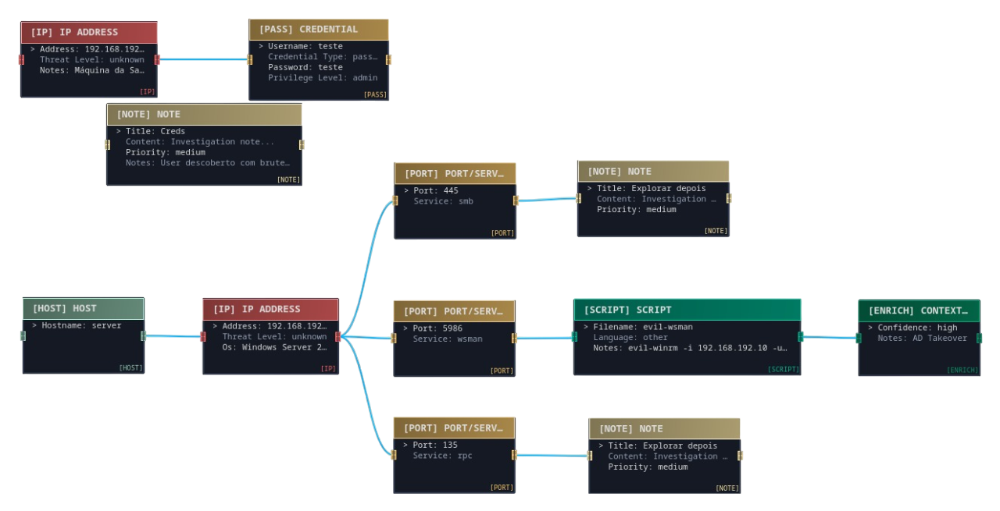

<p align="center">
  
</p>

<p align="center">
  <a href="LICENSE">
    
  </a>
  
  
</p>

> **BeatRooter** é uma plataforma visual de mapeamento e execução de ataques cibernéticos, desenvolvida para Red Team e Blue Team durante a disciplina de Wargaming no ISTEC.

**Visualiza. Mapeia. Ataca. Defende.**

---

## Visão Geral

BeatRooter é uma ferramenta completa de **ataque e defesa** que combina:

- **Canvas Visual de Mapeamento** - Esquematiza sistemas-alvo, topologias de rede, serviços expostos e vectores de ataque
- **Red Team Operations** - Executa reconhecimento, exploração e pós-exploração directamente na plataforma
- **Blue Team Defense** - Mapeia e documenta a tua própria infraestrutura, rede e superfície de ataque
- **30+ Ferramentas Integradas** - Executa nmap, sqlmap, hashcat, hydra e muitas outras sem sair da aplicação
- **AI Assistant (Em Desenvolvimento)** - Assistente inteligente para consultas sobre o sistema e estratégias de ataque

---

## Índice

1. [Funcionalidades Principais](#-funcionalidades-principais)
2. [Como Usar](#%EF%B8%8F-como-usar)
3. [Casos de Uso](#-casos-de-uso)
4. [Ferramentas Integradas](#-ferramentas-integradas)
6. [Contribuir](#-contribuir)
7. [Licença](#-licen%C3%A7a)

---

## Funcionalidades Principais

### Canvas de Mapeamento Interativo

Cria esquemas visuais completos dos teus ataques e sistemas:

- **Red Team**: Mapeia o sistema-alvo, incluindo:
  - Hosts descobertos e estrutura de rede
  - Portas abertas e serviços identificados
  - Vulnerabilidades detectadas e exploits executados
  - Credenciais obtidas (hashes, passwords, tokens)
  - Pivots, lateral movement e persistência
  - Timeline completa do ataque

- **Blue Team**: Documenta a tua infraestrutura:
  - Topologia de rede interna
  - Inventário de sistemas e serviços
  - Políticas de segurança e controlos implementados
  - Superfície de ataque identificada
  - Planos de resposta a incidentes

### Execução Integrada de Ferramentas

Executa **mais de 30 ferramentas** directamente na aplicação:

- **Reconhecimento**: nmap, gobuster, sublist3r, whatweb, whois
- **Exploração**: sqlmap, searchsploit, hydra, patator
- **Post-Exploitation**: linpeas, netcat, revshellgen
- **Cracking**: hashcat, john, cupp, rockyou
- **Análise Forense**: binwalk, exiftool, strings, steghide, ghidra
- **Network Analysis**: tshark, dnsutils, wifite

Todas as ferramentas são executadas com outputs capturados e integrados no canvas.

### AI Assistant (Nábia Coming Soon)

Assistente inteligente para acelerar o teu trabalho:

```
🤖 "O servidor tem a versão Apache 2.4.29, existem CVEs conhecidos para isto?"
🤖 "Qual era o IP atribuído ao servidor de base de dados?"
🤖 "Que credenciais obtive do host 192.168.1.50?"
🤖 "Sugere-me próximos passos baseado no que já descobri"
```

### Sandbox Mode (Planeado e em desenvolvimento)

Modo sandbox para treino seguro:

- **Clonagem de Sistemas**: Replica sistemas e redes completas
- **Ambiente Isolado**: Testa ataques sem risco para produção
- **Snapshot & Restore**: Grava estados do sistema para voltar atrás
- **Attack Simulation**: Simula cenários de ataque realistas

---

## Como Usar

### Instalação

```bash
# Clonar o repositório
git clone https://github.com/definitelynotrafa/ISTEC-Wargaming.git
cd ISTEC-Wargaming

# Instalar dependências
pip install -r requirements.txt

# (Opcional) Instalar ferramentas de segurança
python BeatRooter/main.py
```

### Iniciar a Aplicação

```bash
A trabalhar no instalador...
```

### Começar a Mapear

1. **Criar Novo Canvas** - Escolhe Red Team ou Blue Team
2. **Adicionar Elementos** - Hosts, redes, serviços, notas
3. **Executar Ferramentas** - Selecciona e executa scans directamente
4. **Documentar Resultados** - Anexa outputs, screenshots e descobertas
5. **Exportar Relatório** - Gera documentação completa do engagement

### Exemplo de uso

<p align="center">
  
</p>

---

## Casos de Uso

### 🔴 Red Team - Penetration Testing

**Cenário**: Teste de intrusão a uma aplicação web corporativa

1. **Reconhecimento**: Executa `nmap`, `gobuster`, `whatweb` para descobrir superfície de ataque
2. **Mapeamento**: Adiciona hosts, portas abertas (80, 443, 3306) e serviços identificados ao canvas
3. **Exploração**: Usa `sqlmap` para testar SQL injection, documenta vulnerabilidades encontradas
4. **Credenciais**: Obtém hash via SQLi, usa `hashcat` para crack, regista credenciais no canvas
5. **Post-Exploit**: Estabelece reverse shell com `netcat`, executa `linpeas` para privilege escalation
6. **Relatório**: Exporta canvas completo com timeline, evidências e recomendações

### 🔵 Blue Team - Infrastructure Mapping

**Cenário**: Auditoria de segurança da rede interna

1. **Inventário**: Mapeia todos os sistemas, servidores e dispositivos de rede
2. **Serviços**: Documenta serviços expostos, versões e configurações
3. **Análise**: Identifica serviços desnecessários e superfície de ataque
4. **Hardening**: Planeia e documenta medidas de segurança a implementar
5. **Monitorização**: Integra com `tshark` para análise de tráfego suspeito

### 🟣 Purple Team - Attack Simulation

**Cenário**: Simulação de ataque e validação de defesas

1. **Red**: Executa ataque documentado no canvas (phishing → lateral movement → exfiltration)
2. **Blue**: Observa detecções de SIEM e EDR mapeadas no mesmo canvas
3. **Análise**: Identifica gaps de detecção e áreas de melhoria
4. **Remediação**: Documenta melhorias e testa novamente

---

## Ferramentas Integradas

### Tabela Completa (30+ Tools)

| Ferramenta     | Categoria | Linux | Windows | WSL | Descrição |
|----------------|-----------|--------|---------|------|-----------|
| **binwalk**    | 🔴 Red     | ✔️     | ❌      | ✔️   | Análise de firmware e extração de dados embebidos. |
| **cupp**       | 🔴 Red     | ✔️     | ✔️      | ✔️   | Gera wordlists personalizadas baseadas em info do alvo. |
| **dnsutils**   | 🔵 Blue    | ✔️     | ✔️      | ✔️   | Diagnóstico e enumeração DNS (dig, nslookup, host). |
| **enum4linux** | 🔴 Red     | ✔️     | ❌      | ✔️   | Enumeração SMB/NetBIOS para extração de info Windows. |
| **exiftool**   | 🔵 Blue    | ✔️     | ✔️      | ✔️   | Extrai e analisa metadados de ficheiros (EXIF, IPTC). |
| **ghidra**     | 🔵 Blue    | ✔️     | ✔️      | ✔️   | Suite de engenharia reversa da NSA. |
| **gobuster**   | 🔴 Red     | ✔️     | ✔️      | ✔️   | Fuzzing de diretórios, ficheiros, subdomínios e vhosts. |
| **hashcat**    | 🔴 Red     | ✔️     | ✔️      | ✔️   | Cracking de hashes GPU-accelerated (MD5, SHA, NTLM). |
| **hydra**      | 🔴 Red     | ✔️     | ❌      | ✔️   | Força bruta paralela para múltiplos protocolos. |
| **john**       | 🔴 Red     | ✔️     | ✔️      | ✔️   | John the Ripper - cracking de passwords e hashes. |
| **linpeas**    | 🔴 Red     | ✔️     | ❌      | ✔️   | Script de enumeração e privilege escalation Linux. |
| **netcat**     | 🔴 Red     | ✔️     | ✔️*     | ✔️   | Manipulação de conexões TCP/UDP, reverse shells. |
| **nmap**       | 🔵 Blue    | ✔️     | ✔️      | ✔️   | Scanner de portas, serviços e vulnerabilidades. |
| **patator**    | 🔴 Red     | ✔️     | ✔️      | ✔️   | Framework modular de brute force multi-protocolo. |
| **revshellgen**| 🔴 Red     | ✔️     | ✔️      | ✔️   | Gerador de reverse shells para múltiplas linguagens. |
| **rockyou**    | 🔴 Red     | ✔️     | ✔️      | ✔️   | Wordlist clássica com 14M+ passwords. |
| **rpcclient**  | 🔴 Red     | ✔️     | ✔️      | ✔️   | Cliente RPC para enumeração de sistemas Windows. |
| **searchsploit** | 🔴 Red   | ✔️     | ✔️      | ✔️   | Pesquisa offline na Exploit-DB. |
| **sqlmap**     | 🔴 Red     | ✔️     | ✔️      | ✔️   | SQL Injection automatizado com database takeover. |
| **steghide**   | 🔴 Red     | ✔️     | ✔️      | ✔️   | Esteganografia - esconde/extrai dados de imagens/audio. |
| **strings**    | 🔵 Blue    | ✔️     | ✔️      | ✔️   | Extrai strings ASCII de ficheiros binários. |
| **sublist3r**  | 🔴 Red     | ✔️     | ✔️      | ✔️   | Enumeração de subdomínios via OSINT. |
| **tshark**     | 🔵 Blue    | ✔️     | ✔️      | ✔️   | Wireshark CLI para captura e análise de pacotes. |
| **whatweb**    | 🔴 Red     | ✔️     | ✔️      | ✔️   | Identifica CMS, frameworks e tecnologias web. |
| **whois**      | 🔵 Blue    | ✔️     | ✔️      | ✔️   | Consulta informação de registo de domínios. |
| **wifite**     | 🔴 Red     | ✔️     | ❌      | ✔️   | Framework automatizado de ataques Wi-Fi (WEP/WPA). |

\* *Windows inclui **Ncat** (do Nmap), não o Netcat tradicional.*

**⚠️ Nota**: Apesar da categorização Red/Blue, **todas as ferramentas podem ser usadas em ambos os contextos** conforme a necessidade do utilizador.

---

## Contribuir

Contribuições são bem-vindas! Para contribuir:

### Processo

1. **Fork** este repositório
2. Cria uma **branch** para a tua feature (`git checkout -b feature/amazing-feature`)
3. **Commit** as tuas alterações (`git commit -m 'Add amazing feature'`)
4. **Push** para a branch (`git push origin feature/amazing-feature`)
5. Abre um **Pull Request**

### Guidelines

- **Código**: Segue PEP 8 para Python, inclui docstrings e type hints
- **Testes**: Adiciona testes unitários para novas funcionalidades
- **Documentação**: Actualiza docs se necessário
- **Commits**: Mensagens claras e descritivas
- **Segurança**: Nunca commits credenciais ou dados sensíveis

### Reportar Bugs

Abre uma [issue](https://github.com/definitelynotrafa/ISTEC-Wargaming/issues) com:
- Descrição do problema
- Passos para reproduzir
- Comportamento esperado vs atual
- Screenshots (se aplicável)
- Informação do sistema (OS, Python version, etc.)

---

## Aviso Legal e Responsabilidade

**⚠️ IMPORTANTE**: Esta ferramenta foi desenvolvida **exclusivamente para fins educacionais** no contexto da disciplina de Wargaming do ISTEC.

### Responsabilidade

Os autores **NÃO se responsabilizam** por:
- Uso indevido ou ilegal da ferramenta
- Danos causados a sistemas ou dados
- Violações de leis locais, nacionais ou internacionais
- Consequências legais resultantes do uso inadequado

**O utilizador é o único responsável** por garantir que tem autorização adequada antes de usar qualquer funcionalidade desta ferramenta contra sistemas de terceiros.

---

## Licença

**Proprietary License - Educational Use Only**

Copyright © 2025 ISTEC Wargaming Team

Esta ferramenta é fornecida "AS IS" para fins educacionais. Redistribuição ou uso comercial requer autorização explícita dos autores.

---

## Equipa de Desenvolvimento

<div align="center">
<a href="https://github.com/definitelynotrafa/ISTEC-Wargaming/graphs/contributors">
  
</a>
</div>

---

## Agradecimentos

- **ISTEC** - Instituto Superior de Tecnologias Avançadas
- **Comunidade Open Source** - Autores das ferramentas integradas
- **MITRE ATT&CK** - Framework de referência
- **OWASP** - Metodologias de testing

---

<div align="center">

**[⬆ Voltar ao topo](#-BeatRooter)**

Made with ☕︎ by:

</div>

<table align="center">
<tr>
<td>

<pre>
 ▄▄▄       ███▄    █ ▄▄▄█████▓ ██▓▒██   ██▒▓█████  ██▀███   ▒█████  ▒██   ██▒
▒████▄     ██ ▀█   █ ▓  ██▒ ▓▒▓██▒▒▒ █ █ ▒░▓█   ▀ ▓██ ▒ ██▒▒██▒  ██▒▒▒ █ █ ▒░
▒██  ▀█▄  ▓██  ▀█ ██▒▒ ▓██░ ▒░▒██▒░░  █   ░▒███   ▓██ ░▄█ ▒▒██░  ██▒░░  █   ░
░██▄▄▄▄██ ▓██▒  ▐▌██▒░ ▓██▓ ░ ░██░ ░ █ █ ▒ ▒▓█  ▄ ▒██▀▀█▄  ▒██   ██░ ░ █ █ ▒ 
 ▓█   ▓██▒▒██░   ▓██░  ▒██▒ ░ ░██░▒██▒ ▒██▒░▒████▒░██▓ ▒██▒░ ████▓▒░▒██▒ ▒██▒
 ▒▒   ▓▒█░░ ▒░   ▒ ▒   ▒ ░░   ░▓  ▒▒ ░ ░▓ ░░░ ▒░ ░░ ▒▓ ░▒▓░░ ▒░▒░▒░ ▒▒ ░ ░▓ ░
  ▒   ▒▒ ░░ ░░   ░ ▒░    ░     ▒ ░░░   ░▒ ░ ░ ░  ░  ░▒ ░ ▒░  ░ ▒ ▒░ ░░   ░▒ ░
  ░   ▒      ░   ░ ░   ░       ▒ ░ ░    ░     ░     ░░   ░ ░ ░ ░ ▒   ░    ░  
      ░  ░         ░           ░   ░    ░     ░  ░   ░         ░ ░   ░    ░     
  
</pre>

</td>
</tr>
</table>


